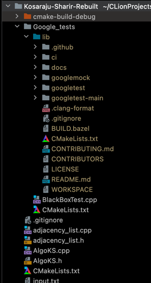

# README

## Kosaraju-Sharir Algorithm Implementation

### Overview

This program reads an input file of vertices and edges and returns
listings of strongly connected components and a list of edges in 
the corresponding kernel graph. The program can also be configured
to accept input from the command line.

For a complete explanation of the Kosaraju-Sharir algorithm:
https://en.wikipedia.org/wiki/Kosaraju%27s_algorithm

### Google Tests

A file of unit tests is included in the Google_tests folder, along
with the CMake file necessary to run the tests. To configure Google
Tests, add a lib folder under /Google_tests to hold the Google Test
files.

